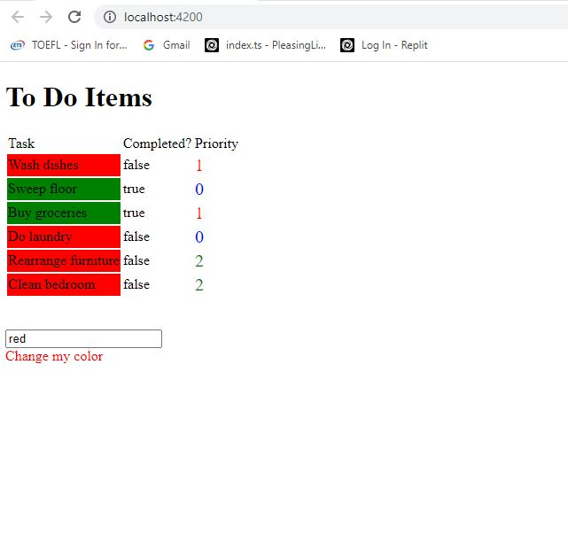

# CssStyling

This project was generated with [Angular CLI](https://github.com/angular/angular-cli) version 14.1.3.

## Development server

Run `ng serve` for a dev server. Navigate to `http://localhost:4200/`. The application will automatically reload if you change any of the source files.

## Requirements of the Project is as follow : 

- This project require styles to be used dynamically.

- It required Task background to be highlighted green or red based on whether the task was completed ( true or false )

- It required Priority be highlighted with diffrent colors ( e.g. Priority 0 with blue, Priority 1 with Red & Priority 2 with green ) 

## The output is seen as below :

